# SolarBoost 项目架构

## 📐 系统架构概览

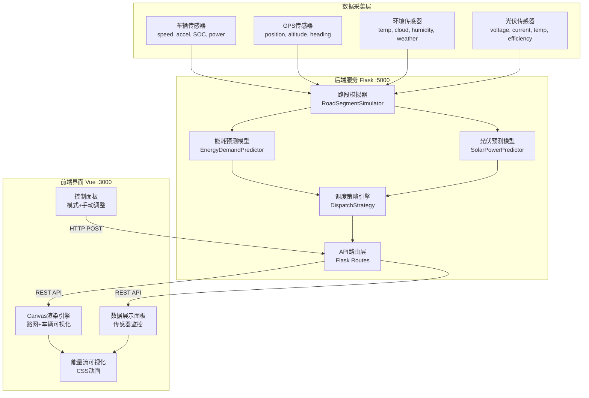

---

## 🔄 数据流图

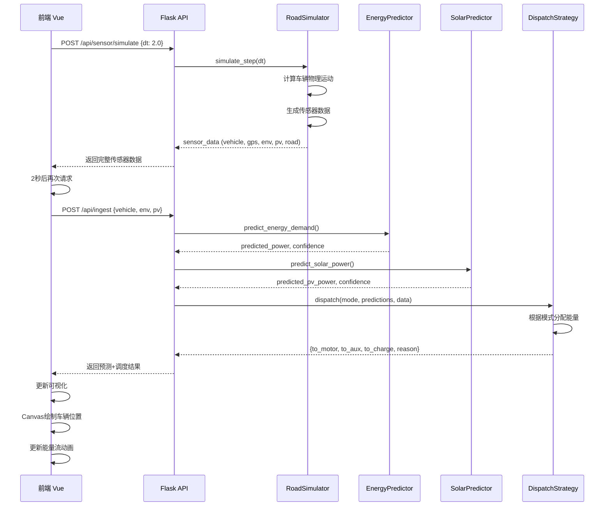

---

## 🏗️ 组件结构

### 后端组件

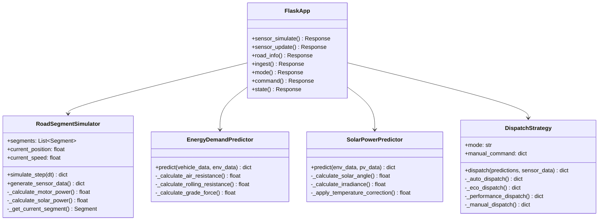

### 前端组件

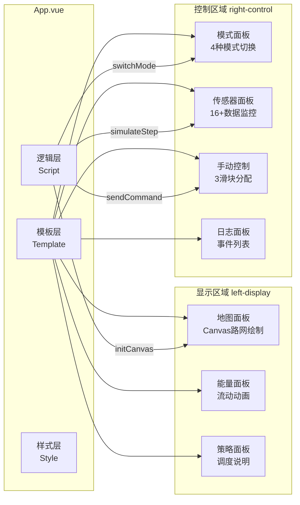

---

## 🗺️ 路段模拟设计

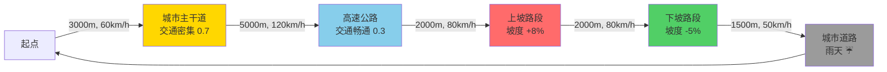

**路段参数表：**

| 路段名称 | 长度(m) | 速限(km/h) | 坡度(%) | 交通密度 | 天气条件 |
|---------|---------|-----------|---------|----------|---------|
| 城市主干道 | 3000 | 60 | 0 | 0.7 | 晴天 |
| 高速公路 | 5000 | 120 | 0 | 0.3 | 晴天 |
| 上坡路段 | 2000 | 80 | +8 | 0.5 | 多云 |
| 下坡路段 | 2000 | 80 | -5 | 0.5 | 多云 |
| 城市道路 | 1500 | 50 | 0 | 0.6 | 雨天 |
| **总计** | **13500** | - | - | - | - |

---

## ⚡ 能量调度算法

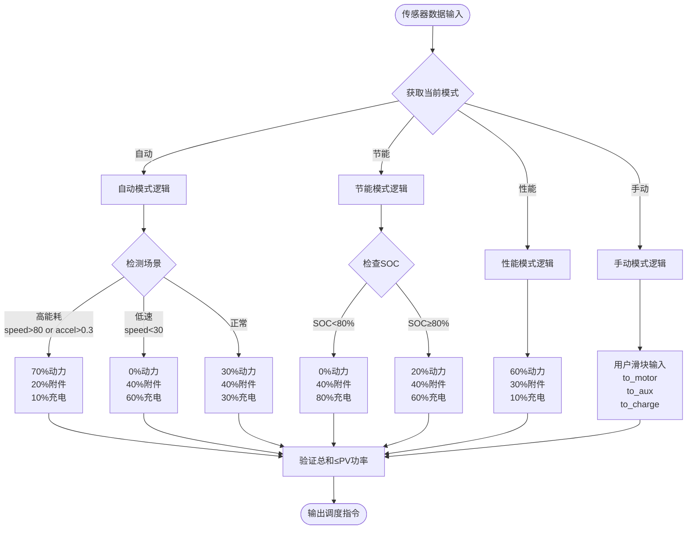

---

## 🌐 API 端点映射

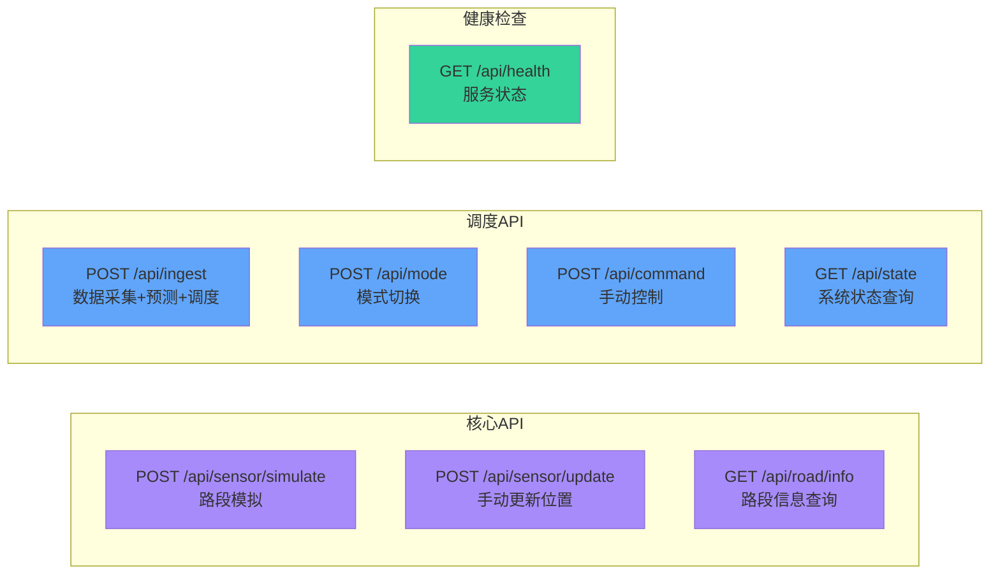

---

## 🎨 前端UI布局

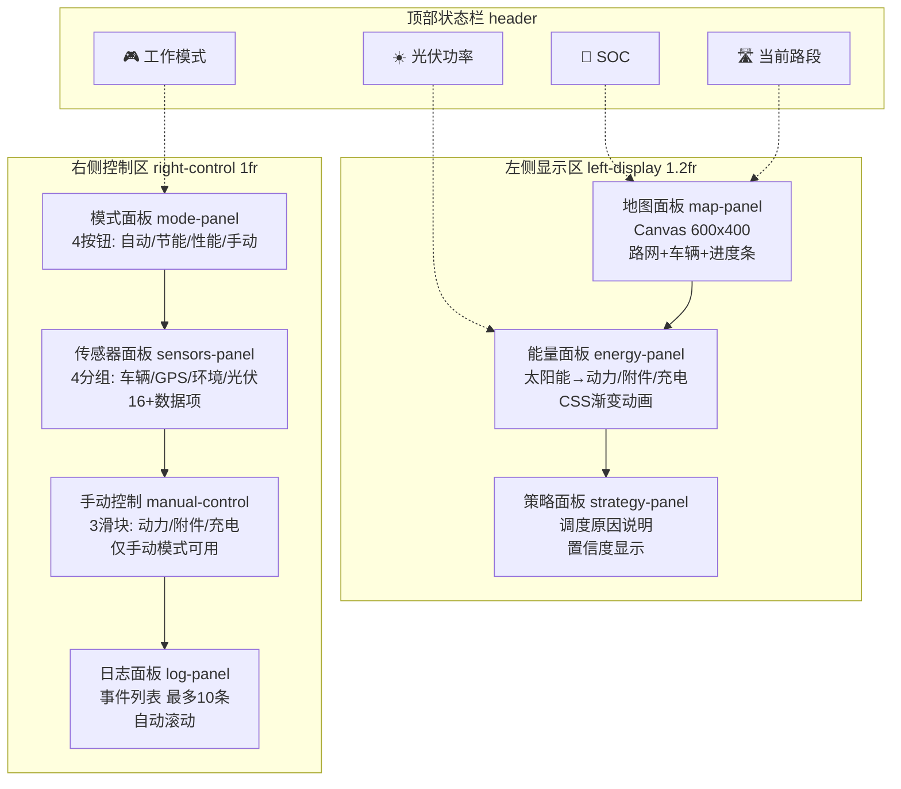

---

## 🧮 物理模型

### 能耗计算

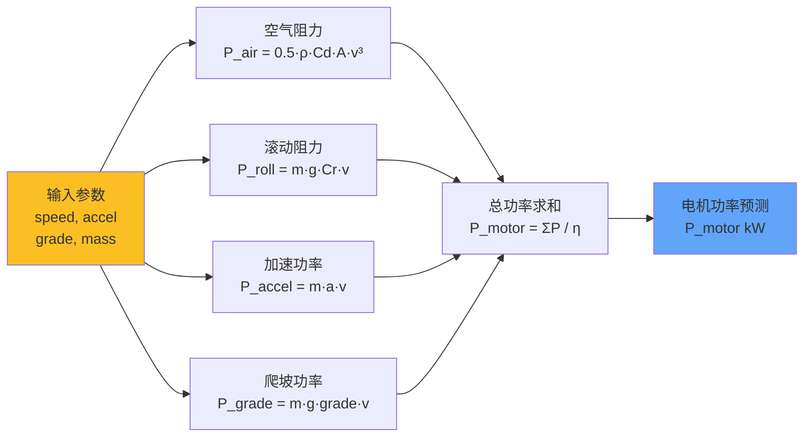

**参数表：**
- ρ (空气密度) = 1.225 kg/m³
- Cd (风阻系数) = 0.28
- A (迎风面积) = 2.5 m²
- Cr (滚阻系数) = 0.01
- m (车辆质量) = 1800 kg
- g (重力加速度) = 9.8 m/s²
- η (传动效率) = 0.9

### 光伏发电计算

```mermaid
flowchart LR
    Time[时间<br/>hour] --> Angle[太阳高度角<br/>θ = π·(h-6)/12]
    Angle --> Intensity[辐照强度<br/>I = sin(θ)·1000 W/m²]
    
    Weather[天气<br/>cloud] --> CloudFactor[云量修正<br/>f_c = 1 - 0.7·cloud]
    Temp[温度<br/>temp°C] --> TempFactor[温度修正<br/>f_t = 1 - 0.002·(T-25)]
    
    Intensity --> Combine[功率计算<br/>P = A·η·I·f_c·f_t]
    CloudFactor --> Combine
    TempFactor --> Combine
    
    Combine --> Output[光伏功率输出<br/>P_pv kW]
    
    style Time fill:#fbbf24
    style Weather fill:#fbbf24
    style Temp fill:#fbbf24
    style Output fill:#34d399
```

**参数表：**
- A (面板面积) = 10 m²
- η (转换效率) = 18%
- P_max (峰值功率) = 1.8 kW
- 工作温度范围 = -20°C ~ 85°C

---

## 📊 数据结构

### 传感器数据结构

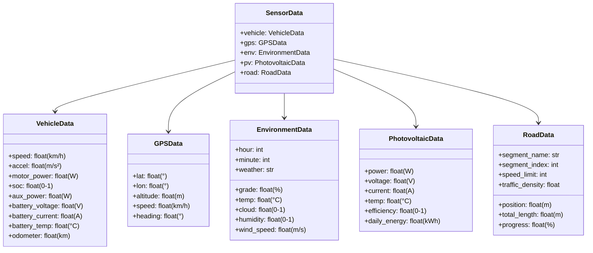

---

## 🎯 技术选型理由

| 技术栈 | 选型 | 理由 |
|-------|------|------|
| **后端框架** | Flask 3.0 | 轻量级、快速开发、RESTful API友好 |
| **跨域支持** | Flask-CORS | 简单配置解决前后端分离跨域问题 |
| **数值计算** | NumPy 2.2.6 | 高性能数组运算、物理模型计算 |
| **前端框架** | Vue.js 3.3 | 响应式、组件化、开发效率高 |
| **构建工具** | Vite 4.5 | 极速启动、热更新、现代化构建 |
| **HTTP客户端** | Axios 1.5 | Promise API、拦截器、错误处理 |
| **可视化** | Canvas 2D | 高性能路网绘制、灵活自定义 |
| **样式方案** | 原生CSS | 无依赖、完全掌控、CSS动画性能好 |
| **语言** | Python 3.13 | 科学计算生态丰富、类型提示 |
| **开发环境** | Windows + PowerShell | 与目标部署环境一致 |

---

## 🚀 性能优化策略

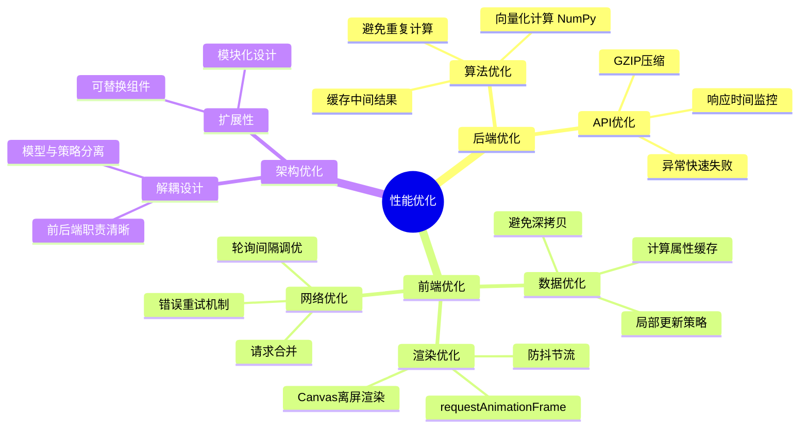

---

## 🔐 安全性考虑

1. **输入验证**：所有API请求参数验证类型和范围
2. **错误处理**：统一异常捕获，避免敏感信息泄露
3. **CORS配置**：仅允许特定源访问（生产环境需配置）
4. **物理约束**：功率分配总和不超过可用功率
5. **安全回退**：异常情况下回退到安全的默认值

---

## 📈 未来扩展方向

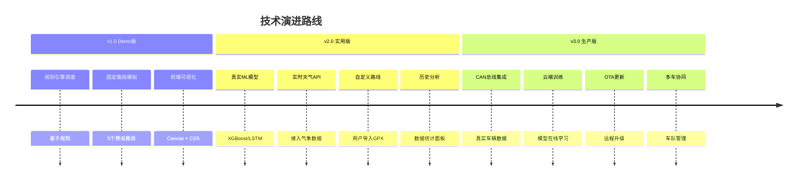

---

## 🧪 测试策略

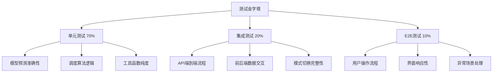

---

## 📚 参考文档

- [Flask官方文档](https://flask.palletsprojects.com/)
- [Vue.js 3文档](https://vuejs.org/)
- [Canvas API](https://developer.mozilla.org/en-US/docs/Web/API/Canvas_API)
- [电动汽车能耗模型论文](https://ieeexplore.ieee.org/)
- [光伏发电预测算法](https://www.sciencedirect.com/)

---

## 🏆 项目亮点

✨ **创新性**
- 路段级能量调度：细粒度优化策略
- 多模式融合：自动/节能/性能/手动无缝切换
- 实时可视化：Canvas路网+CSS能量流动画

🎯 **实用性**
- 真实物理模型：基于空气/滚阻/坡度计算
- 完整传感器模拟：16+数据项实时更新
- 用户友好界面：左显示右控制清晰布局

🚀 **可扩展性**
- 模块化设计：预测器/调度器可独立替换
- 标准RESTful API：易于集成第三方服务
- 渐进式架构：从Demo到生产的清晰路径

---

**文档版本：** v1.0  
**最后更新：** 2025年  
**维护者：** SolarBoost Team